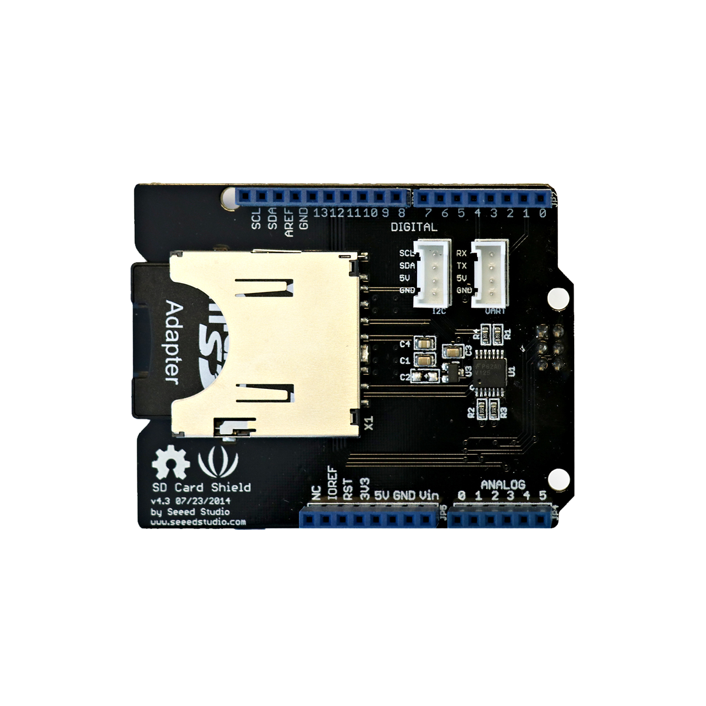

# SD-Karten-Shield

## Beschreibung
Das SD-Karten-Shield ist eine Erweiterungsplatine für Arduino-ähnliche Mikrocontroller. Diese Erweiterungsplatinen werden im Allgemeinen als „Shield“ bezeichnet und werden einfach auf den entsprechenden Controller oder Einplatinencomputer gesteckt. Diese vereinfachen das Anschließen von speziellen Komponenten enorm.

Diese spezielle Ausführung erweitert einen Arduino um einen SD-Karten-Anschluss. Dadurch kann der Mikrocontroller Daten oder Informationen auf einer SD-Karte zwischenspeichern oder von dieser auslesen. Dabei können sowohl normale SD-Karten als auch Mikro-SD-Karten (mittels beiliegendem Adapter) verwendet werden.

Das Shield wird auf den Arduino gesteckt und ist damit mit allen relevanten Anschlüssen des Controllers verbunden. Es nutzt die serielle Schnittstelle SPI und lässt alle anderen Anschlusspins des Arduinos unberührt. Es stellt zusätzlich zwei serielle Anschlüsse in Form des standardisierten Grove-Steckplatzes bereit.

Alle weiteren Hintergrundinformationen sowie ein Beispielaufbau und alle notwendigen Programmbibliotheken sind auf dem offiziellen Wiki (bisher nur in englischer Sprache) von Seeed Studio zusammengefasst. Zusätzlich findet man über alle gängigen Suchmaschinen durch die Eingabe der genauen Komponentenbezeichnung entsprechende Projektbeispiele und Tutorials.

## Beispiele

!!!show-examples:./examples/

<!-- infolist -->

## Wichtige Links für die ersten Schritte:

- [Seeed Studio Wiki](http://wiki.seeedstudio.com/SD_Card_shield_V4.0/) [- SD-Karten-Shield](http://wiki.seeedstudio.com/SD_Card_shield_V4.0/)

## Weiterführende Hintergrundinformationen:

- [SD-Karte - Wikipedia Artikel](https://de.wikipedia.org/wiki/SD-Karte)
- [I2C - Wikipedia Artikel](https://de.wikipedia.org/wiki/I%C2%B2C)
- [SPI - Wikipedia Artikel](https://de.wikipedia.org/wiki/Serial_Peripheral_Interface)
- [UART - Wikipedia Artikel](https://de.wikipedia.org/wiki/Universal_Asynchronous_Receiver_Transmitter)
- [GitHub-Repository: SD-Karten-Shield](https://github.com/MakeYourSchool/73-SD-Karten-Shield)

